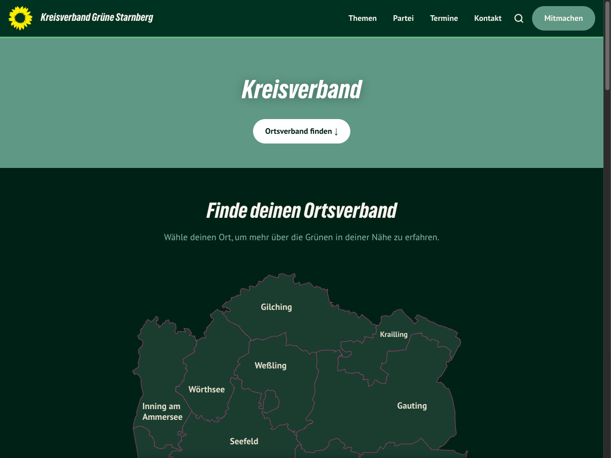

# [Neurg Kreisverband](https://neurg.de)

WordPress-Theme fuer GRUENE Kreisverband- und Ortsverband-Websites.

**[neurg.de](https://neurg.de)** — Download, Dokumentation und Demo.

Für die Redaktion: [Benutzerhandbuch für Redaktion und Administration](docs/BENUTZERHANDBUCH.md).
Release 0.7.1: [Änderungen und Prüfungen](docs/RELEASE-0.7.1.md).
Update und Rollback: [Installationsablauf](docs/RELEASE-0.7.0.md).



Inspiriert von "Joseph knows best" von Benjamin Jopen (kre8tiv.de) und der Weiterentwicklung von Andreas Gregor (andreasgregor.de). Vollstaendig neu aufgebaut von Severin Kistner (neurg.de).

## Features

- Personendatenbank mit Abteilungen und Zuordnungen
- Interaktive SVG-Kreiskarte (OpenStreetMap-basiert)
- Ortsverband-Verwaltung mit eigenem Routing und Templates
- Termin-/Eventmanagement mit iCal-Export
- Flexible Shortcodes (Vorstand, Mandate, Landesliste, Gliederungen, u.v.m.)
- Eingebautes SEO (Open Graph, JSON-LD, Meta-Descriptions)
- Spenden-Integration (Twingle, Bankverbindung)
- Kontaktformular mit Spam-Schutz
- Cookie-Consent-Banner (DSGVO)
- Social-Media-Integration
- Benutzerdefinierte Rollen: Kreisadmin, OV-Admin, OV-Autor
- Setup-Wizard fuer Ersteinrichtung

## Quick Start

```bash
make setup    # Start containers, install WP, activate theme, seed demo data
```

WordPress: http://localhost:8080 (admin / admin) | phpMyAdmin: http://localhost:8081

## Branch Flow

| Branch | Purpose |
|--------|---------|
| `main` | Stable releases only. Each commit = one release. Tagged with `vX.Y.Z`. |
| `dev` | Active development. All work happens here. |

### Workflow

1. Work on `dev` (commit freely, messy history is fine)
2. When ready for a release:
   - Update version in `theme/style.css`, `theme/functions.php` (`GK_VERSION`), `theme/readme.txt` and `package.json`
   - Squash-merge `dev` into `main`: `git checkout main && git merge --squash dev`
   - Commit with release message, tag: `git tag vX.Y.Z`
   - Push: `git push origin main --tags`
   - GitHub Actions publishes the release ZIP and `SHA256SUMS` automatically
3. After merging, update `dev`: `git checkout dev && git merge main`

### Release Checklist

```bash
# 1. On dev: bump version
#    Edit style.css (Version:), functions.php (GK_VERSION), readme.txt and package.json

# 2. Build and verify
make test
make phpcs
make js-check
make zip              # Validates versions match, structure, no dev files

# 3. Squash-merge to main
git checkout main
git merge --squash dev
git commit -m "vX.Y.Z: summary of changes"
git tag vX.Y.Z
git push origin main --tags

# 4. Sync dev
git checkout dev
git merge main
git push origin dev
```

## Development

See [CONTRIBUTING.md](CONTRIBUTING.md) for full setup, testing, and project structure.

## License

GPL-2.0-or-later
